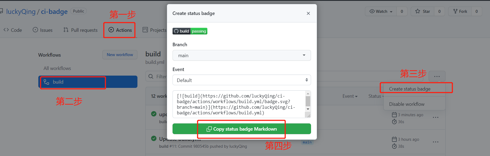

github项目常见徽章如何生成？
---
[](https://github.com/luckyQing/ci-badge/actions/workflows/build.yml)
[](https://codecov.io/gh/luckyQing/ci-badge)
[](https://github.com/luckyQing/ci-badge/actions/workflows/codeql-analysis.yml)
[](https://www.apache.org/licenses/LICENSE-2.0.html)
[](https://docs.oracle.com/javase/8/docs/api/)


# 一、build passing
github项目——>Actions——>New workflow——>Java with Maven

# 二、codecov
codecov是一个测试结果分析工具
- 去codecov官网（https://app.codecov.io/gh）用github账号登陆并授权，选择要分析的仓库
- pom.xml中添加jacoco插件
  ```
    <plugin>
        <groupId>org.jacoco</groupId>
        <artifactId>jacoco-maven-plugin</artifactId>
        <version>${jacoco-maven-plugin.version}</version>
        <executions>
            <execution>
                <goals>
                    <goal>prepare-agent</goal>
                </goals>
            </execution>
            <execution>
                <id>report</id>
                <phase>test</phase>
                <goals>
                    <goal>report</goal>
                </goals>
            </execution>
        </executions>
    </plugin>
  ```
- 添加codecov.yml（参考：https://docs.codecov.com/docs/codecovyml-reference）
  ```
    codecov:
    require_ci_to_pass: yes
    coverage:
    status:
    patch: no
    project:
    default:
    threshold: 1%
    if_not_found: success
    changes: no
    precision: 2
    range: "50...100"
    ignore:
    - "test/.*"
    - ".github/.*"
    - ".mvn/.*"
    - ".style/.*"
    - "*.md"
      comment:
      layout: "reach,diff,flags,tree"
      behavior: default
      require_changes: no
  ```
- 修改.github/workflows/build.yml
  ```dtd
    - name: Codecov
      uses: codecov/codecov-action@v1.5.0
  ```
  
# 三、codeql
新增.github/workflows/codeql-analysis.yml
```
name: "CodeQL"

on:
  push:
    branches: [ main ]
  pull_request:
    # The branches below must be a subset of the branches above
    branches: [ main ]
  schedule:
    - cron: '36 19 * * 6'

jobs:
  analyze:
    name: Analyze
    runs-on: ubuntu-latest
    permissions:
      actions: read
      contents: read
      security-events: write

    strategy:
      fail-fast: false
      matrix:
        language: [ 'java' ]
        # CodeQL supports [ 'cpp', 'csharp', 'go', 'java', 'javascript', 'python' ]
        # Learn more:
        # https://docs.github.com/en/free-pro-team@latest/github/finding-security-vulnerabilities-and-errors-in-your-code/configuring-code-scanning#changing-the-languages-that-are-analyzed

    steps:
    - name: Checkout repository
      uses: actions/checkout@v2

    # Initializes the CodeQL tools for scanning.
    - name: Initialize CodeQL
      uses: github/codeql-action/init@v1
      with:
        languages: ${{ matrix.language }}
        # If you wish to specify custom queries, you can do so here or in a config file.
        # By default, queries listed here will override any specified in a config file.
        # Prefix the list here with "+" to use these queries and those in the config file.
        # queries: ./path/to/local/query, your-org/your-repo/queries@main

    # Autobuild attempts to build any compiled languages  (C/C++, C#, or Java).
    # If this step fails, then you should remove it and run the build manually (see below)
    - name: Autobuild
      uses: github/codeql-action/autobuild@v1

    # ℹ️ Command-line programs to run using the OS shell.
    # 📚 https://git.io/JvXDl

    # ✏️ If the Autobuild fails above, remove it and uncomment the following three lines
    #    and modify them (or add more) to build your code if your project
    #    uses a compiled language

    #- run: |
    #   make bootstrap
    #   make release

    - name: Perform CodeQL Analysis
      uses: github/codeql-action/analyze@v1
```
# 四、其他
https://shields.io/
